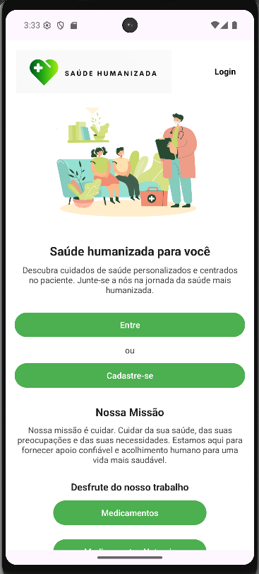
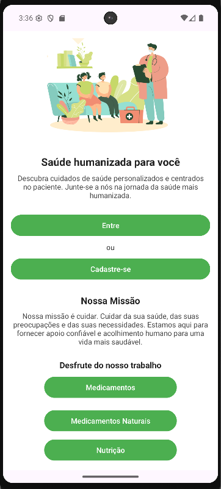
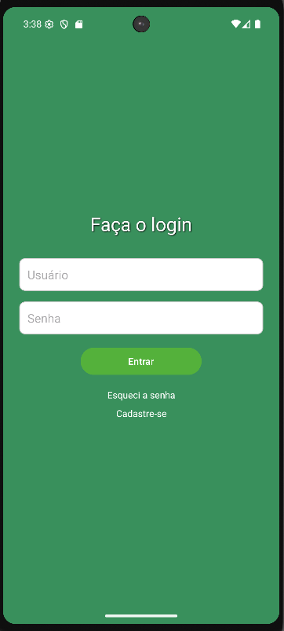
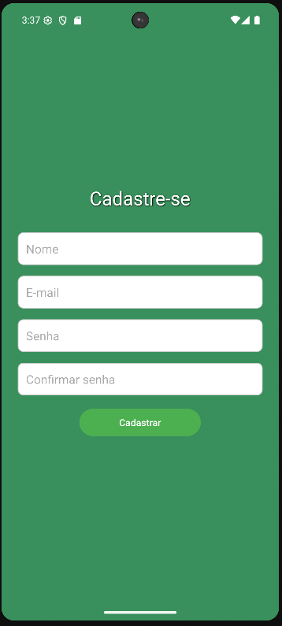
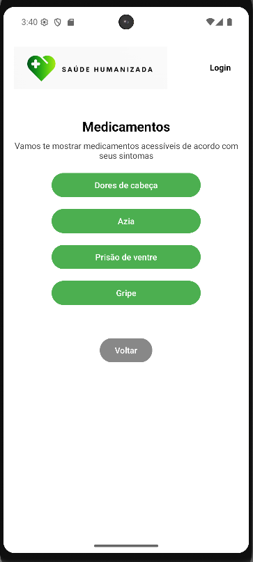
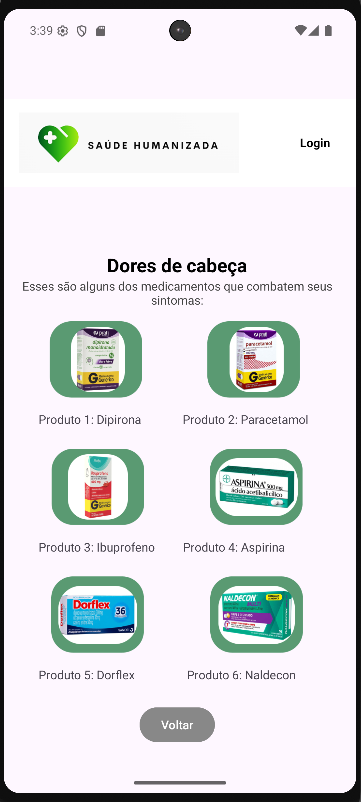
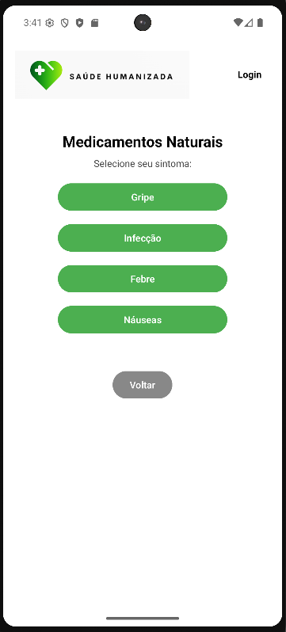
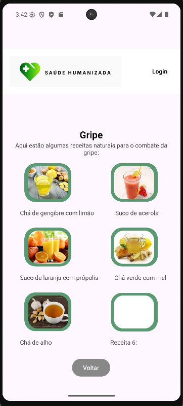
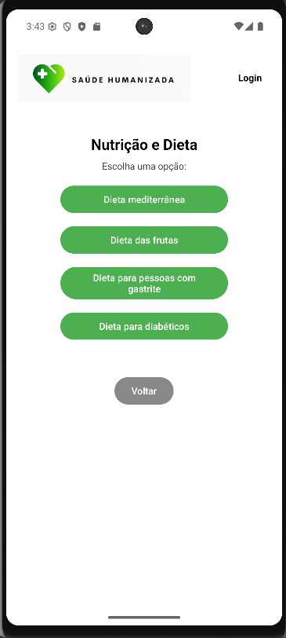
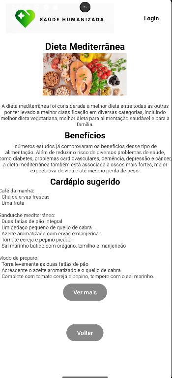

# 📱 App de Saúde Humanizada

Aplicativo mobile desenvolvido para **Android** com o objetivo de fornecer informações sobre **saúde, nutrição, medicamentos e alternativas naturais de cuidado com o bem-estar**.

O projeto representa a **versão mobile de uma plataforma de saúde humanizada**, inicialmente prototipada durante o curso de **Sistemas de Informação**, e posteriormente implementada como aplicação funcional utilizando **Android Studio**.

A aplicação reúne conteúdos informativos sobre saúde e permite que usuários naveguem por diferentes seções relacionadas a **medicamentos, nutrição, dietas e cuidados naturais**, contribuindo para o acesso a informações de forma simples e organizada.

---

# 🚀 Tecnologias Utilizadas

* Java
* Android Studio
* Android SDK
* XML (layouts Android)

---

# 📱 Funcionalidades do Aplicativo

O aplicativo oferece funcionalidades voltadas à consulta de informações sobre saúde e bem-estar:

* Cadastro de usuário
* Login no sistema
* Consulta de informações sobre medicamentos
* Consulta de medicamentos naturais
* Informações sobre nutrição
* Sugestões de dietas
* Conteúdos sobre sucos naturais e alimentação saudável

Essas funcionalidades foram organizadas em diferentes telas para facilitar a navegação do usuário dentro do aplicativo.

---

# 🧩 Estrutura do Projeto

O projeto segue a estrutura padrão de aplicações Android:

```text
app/
 ├── java/
 │    └── atividades e classes do aplicativo
 │
 ├── res/
 │    ├── layout/        → telas do aplicativo (XML)
 │    ├── drawable/      → imagens e ícones
 │    └── values/        → cores, strings e estilos
 │
 └── AndroidManifest.xml
```

---

# ▶️ Como Executar o Projeto

### 1️⃣ Clonar o repositório

```bash
git clone https://github.com/stephanievitoria/saude-humanizada-mobile.git
```

### 2️⃣ Abrir no Android Studio

Abra o projeto utilizando o **Android Studio**.

### 3️⃣ Executar o aplicativo

Conecte um **emulador Android** ou dispositivo físico e execute o projeto diretamente pelo Android Studio.

---

# 📸 Screenshots

### Tela Inicial



### Login


### Cadastro


### Medicamentos



### Medicamentos Naturais



### Nutrição e Dieta



---

# 🎓 Contexto Acadêmico

Este projeto foi desenvolvido como parte das atividades do curso de **Sistemas de Informação**.

* **1º e 2º semestre:** criação do protótipo e desenvolvimento web de uma plataforma de **saúde humanizada**.
* **4º semestre:** desenvolvimento da **versão mobile do projeto**, utilizando **Android Studio**, na disciplina de **Desenvolvimento Mobile**.

O objetivo foi transformar o protótipo inicial em uma **aplicação funcional para dispositivos Android**, aplicando conceitos de desenvolvimento mobile aprendidos durante o curso.

---

# 👩‍💻 Autora

**Stephanie Vitoria Soares da Cruz**

Estudante de **Sistemas de Informação**, com interesse em desenvolvimento de software, APIs e aplicações mobile.
